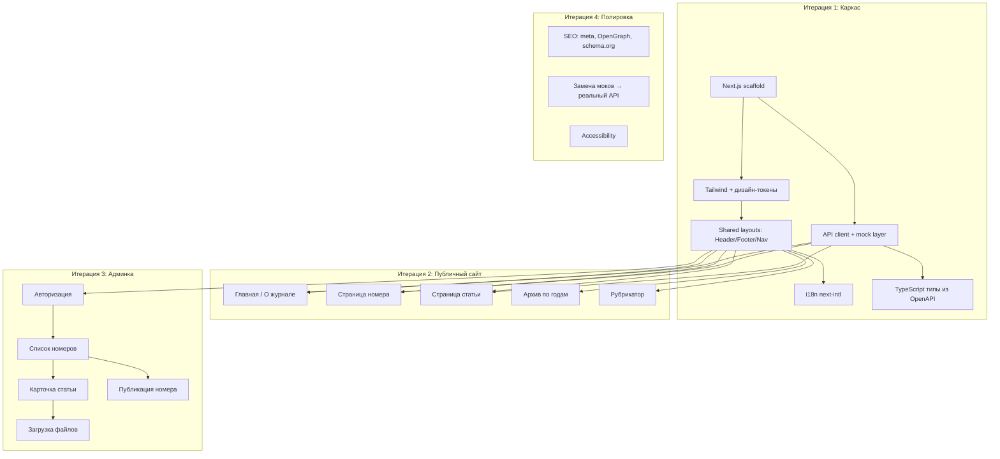

# Implementation Plan: Фронтенд ВТЭ

## Цель

Next.js 15 приложение для журнала «Вопросы теоретической экономики»: публичный сайт + админ-панель. Работает на mock-данных до готовности бэкенда, переключается на реальный API одним env-флагом.

## Дизайн-референс

Согласованные макеты: `02_src/design/` (зелёная палитра, гармонирующая с обложками журнала).

Дизайн-токены:
- Шрифты: Cormorant Garamond (заголовки), IBM Plex Sans (тело)
- Основной: forest `#2B3D2F`, тёмный `#19251D`
- Акцент: copper `#B07D3A`
- Ссылки: teal `#1A7A6D`
- Фоны: stone `#F7F5F0`, `#F0EDE6`

## Архитектурная схема



## Стратегия моков

Mock layer в `lib/api/mock/` — JSON-фикстуры с реальным контентом из `03_data/sample_content.md`. Переключение через `NEXT_PUBLIC_API_MODE=mock|real` в `.env.local`.

```typescript
// lib/api/client.ts
export function getApiClient() {
  if (process.env.NEXT_PUBLIC_API_MODE === 'mock') {
    return mockClient;  // Статичные данные
  }
  return realClient;    // fetch к бэкенду
}
```

## Итерации

### Итерация 1: Каркас + дизайн-система
**Статус:** Выполнена (2026-03-28)

**Что делаем:**
- `npx create-next-app` с TypeScript, Tailwind, App Router
- Tailwind config с дизайн-токенами (forest/copper/teal/stone)
- Google Fonts: Cormorant Garamond, IBM Plex Sans
- Shared layouts: PublicLayout (Header, Nav, Footer, Breadcrumbs), AdminLayout (Sidebar)
- shadcn/ui init
- next-intl с базовыми переводами (RU/EN)
- API client с mock layer, TypeScript типы
- Mock-фикстуры: 1 номер (№1/2026) с 12 статьями

**Критерий готовности:** Открывается главная страница с шапкой/футером, переключатель RU/EN работает.

---

### Итерация 2: Публичные страницы
**Статус:** Выполнена (2026-03-28)

**Страницы:**
1. `/` — Главная / О журнале (статика + блок свежего номера из API)
2. `/archive/[year]/[issue]` — Страница номера (содержание по рубрикам)
3. `/article/[id]` — Страница статьи (полные метаданные, табы аннотации RU/EN)
4. `/archive/[year]` — Архив за год (сетка обложек)
5. `/sections/[slug]` — Рубрикатор (статьи по рубрике)
6. Статические страницы: Редколлегия, Авторам, Этика, Контакты

**Критерий готовности:** Все страницы рендерятся с mock-данными, навигация работает, адаптивность.

---

### Итерация 3: Админка
**Статус:** Выполнена (2026-03-28)

**Страницы:**
1. `/admin/login` — Авторизация (JWT)
2. `/admin/issues` — Список номеров (таблица, фильтры)
3. `/admin/issues/[id]` — Номер: список статей, drag-and-drop сортировка, загрузка обложки/PDF
4. `/admin/articles/[id]` — Карточка статьи (форма со всеми полями из макета)
5. Предпросмотр статьи и содержания номера
6. Кнопка «Опубликовать»

**Критерий готовности:** Можно заполнить карточку статьи, увидеть предпросмотр, "опубликовать" номер.

---

### Итерация 4: Интеграция и полировка
**Статус:** Частично выполнена (контент, визуальные фиксы — 2026-03-28)

- SEO: метатеги, OpenGraph, schema.org/ScholarlyArticle
- SSG/ISR для публичных страниц
- Замена mock → real API (когда бэкенд готов)
- Accessibility (ARIA, фокус, контрасты)
- Тесты ключевых сценариев
