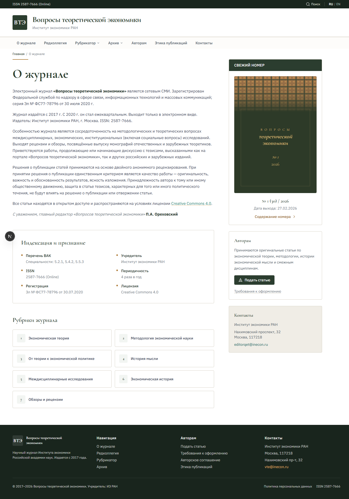

# Вопросы теоретической экономики — Фронтенд

Фронтенд научного журнала **«Вопросы теоретической экономики»** ([questionset.ru](https://questionset.ru)), издаваемого Институтом экономики РАН.

Включает **публичный сайт** для читателей и **админ-панель** для редакции. Работает автономно на mock-данных, переключается на реальный бэкенд одной переменной окружения.



## Технологии

- **Next.js 16** (App Router, React Server Components, SSG/ISR)
- **React 19** + **TypeScript 5**
- **Tailwind CSS v4** (дизайн-токены через `@theme inline`)
- **next-intl** (двуязычность RU/EN)
- **Lucide React** (иконки)

## Быстрый старт

### Требования

- Node.js 20+
- npm

### Установка и запуск

```bash
cd 02_src/vte-frontend
npm install
npm run dev
```

Открыть [http://localhost:3000](http://localhost:3000)

По умолчанию фронтенд работает на **mock-данных** — бэкенд не нужен. В mock-данных 5 номеров журнала (2025-2026), 48 статей с реальными заголовками и авторами, 28 членов редколлегии.

### Переключение на реальный API

Когда бэкенд готов, изменить `.env.local`:

```
NEXT_PUBLIC_API_MODE=real
NEXT_PUBLIC_API_URL=http://localhost:8000
```

Перезапустить `npm run dev`.

## Страницы

### Публичный сайт (11 страниц)

| Страница | URL | Описание |
|----------|-----|----------|
| Главная / О журнале | `/` | Информация о журнале, обращение редактора, блок свежего номера |
| Редколлегия | `/editorial-board` | 28 членов с регалиями, ORCID, SPIN |
| Рубрикатор | `/sections` | 7 тематических рубрик журнала |
| Статьи по рубрике | `/sections/{slug}` | Все статьи в рубрике за все годы |
| Архив (годы) | `/archive` | Список годов с номерами |
| Архив за год | `/archive/{year}` | Сетка обложек номеров |
| Страница номера | `/archive/{year}/{issue}` | Содержание: статьи по рубрикам, раскрывающиеся аннотации |
| Страница статьи | `/article/{id}` | DOI, авторы с ORCID, аннотация RU/EN, библиография, PDF/XML |
| Авторам | `/authors` | Порядок подачи, требования к оформлению |
| Этика публикаций | `/ethics` | Этические нормы журнала |
| Контакты | `/contacts` | Адрес, телефон, email редакции |

### Админ-панель (4 страницы)

| Страница | URL | Описание |
|----------|-----|----------|
| Авторизация | `/admin/login` | Логин/пароль (JWT) |
| Список номеров | `/admin/issues` | Таблица с фильтрами по году и статусу |
| Редактирование номера | `/admin/issues/{id}` | Метаданные, загрузка обложки/PDF, список статей |
| Карточка статьи | `/admin/articles/{id}` | Форма: рубрика, авторы, аннотация, DOI, библиография, файлы |

### Двуязычность

Переключатель RU/EN в шапке. При выборе EN — навигация, футер и главная страница отображаются на английском. Данные статей используют поле `en` из `LocalizedString` с фоллбэком на русский.

## Качество

Lighthouse-аудит всех 15 страниц:

| Метрика | Результат |
|---------|-----------|
| Accessibility | **100** на всех страницах |
| SEO | **100** на всех страницах |
| Best Practices | 81 (HTTPS — решается при деплое) |

## Структура проекта

```
02_src/vte-frontend/src/
├── app/
│   ├── (public)/                   # Публичный сайт (11 страниц)
│   │   ├── page.tsx                # Главная / О журнале
│   │   ├── archive/                # Архив номеров
│   │   ├── article/[id]/           # Страница статьи
│   │   ├── sections/               # Рубрикатор
│   │   ├── editorial-board/        # Редколлегия
│   │   ├── authors/, ethics/...    # Статические страницы
│   │   └── layout.tsx              # Общий layout (Header, Nav, Footer)
│   ├── (admin)/admin/              # Админ-панель (4 страницы)
│   │   ├── login/, issues/, articles/
│   │   └── layout.tsx              # Admin layout (Sidebar)
│   └── layout.tsx                  # Root layout (шрифты, i18n)
├── components/
│   └── public/                     # Header, Footer, Nav, JournalCover, ArticleCard...
├── lib/
│   ├── api/client.ts               # API-клиент (mock/real)
│   ├── api/mock/data.ts            # 48 статей, 5 номеров, 28 редколлегия
│   ├── types/index.ts              # TypeScript типы API-контрактов
│   └── i18n/LanguageContext.tsx     # Переключение RU/EN
```

## API-контракт

Полная OpenAPI 3.0 спецификация с примерами ответов: [`00_docs/architecture/api-spec.yaml`](00_docs/architecture/api-spec.yaml)

### Эндпоинты, используемые фронтендом

| Страница | Эндпоинт | Метод |
|----------|----------|-------|
| Главная | `/api/issues/latest/` | GET |
| Архив за год | `/api/issues/?year=2026` | GET |
| Архив (годы) | `/api/issues/years/` | GET |
| Страница номера | `/api/issues/{id}/` | GET |
| Страница статьи | `/api/articles/{id}/` | GET |
| Рубрики | `/api/sections/` | GET |
| Статьи по рубрике | `/api/sections/{slug}/articles/` | GET |
| Редколлегия | `/api/editorial-board/` | GET |
| Поиск | `/api/search/?q={query}` | GET |

### Минимум для запуска публичного сайта

Достаточно **4 эндпоинта**:

1. `GET /api/issues/latest/` — `IssueSummary`
2. `GET /api/issues/{id}/` — `IssueFull` (номер со статьями по рубрикам)
3. `GET /api/articles/{id}/` — `ArticleFull` (полные метаданные статьи)
4. `GET /api/issues/?year=N` — `IssueSummary[]`

### CORS

Бэкенд должен разрешить:

```
Access-Control-Allow-Origin: http://localhost:3000
Access-Control-Allow-Methods: GET, POST, PUT, DELETE, OPTIONS
Access-Control-Allow-Headers: Content-Type, Authorization
```

Рекомендуется `django-cors-headers`.

## TypeScript типы

Типы API-контрактов: [`src/lib/types/index.ts`](02_src/vte-frontend/src/lib/types/index.ts)

Все текстовые поля с двуязычным содержимым используют:

```typescript
interface LocalizedString {
  ru: string;
  en?: string;  // опционально, фронтенд фоллбэчит на ru
}
```

Ключевые типы: `IssueSummary`, `IssueFull`, `ArticleSummary`, `ArticleFull`, `Author`, `EditorialBoardMember`, `Section`, `Reference`.

## Дизайн

Согласованные HTML-макеты в `02_src/design/` (зелёная палитра, гармонирующая с печатными обложками журнала). Альтернативный вариант — `02_src/design-alt-navy/` (синяя палитра).

**Дизайн-токены:**

| Назначение | Значение |
|------------|----------|
| Заголовки | Cormorant Garamond |
| Тело текста | IBM Plex Sans |
| Основной цвет | `#2B3D2F` (forest) |
| Акцент | `#B07D3A` (copper) |
| Ссылки | `#1A7A6D` (teal) |
| Фоны | `#F7F5F0`, `#F0EDE6` (stone) |

## Скрипты

| Команда | Описание |
|---------|----------|
| `npm run dev` | Dev-сервер на http://localhost:3000 |
| `npm run build` | Продакшн-сборка |
| `npm run start` | Продакшн-сервер |
| `npm run lint` | Проверка ESLint |

