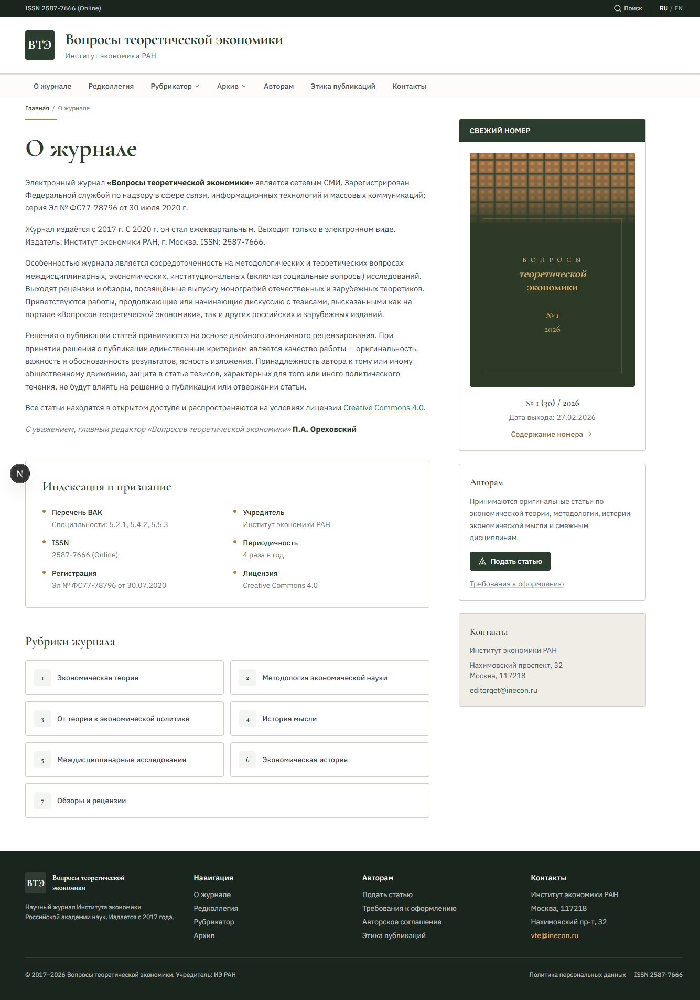

# Вопросы теоретической экономики — Фронтенд

Фронтенд научного журнала **«Вопросы теоретической экономики»** ([questionset.ru](https://questionset.ru)), издаваемого Институтом экономики РАН.

Включает **публичный сайт** для читателей и **админ-панель** для редакции. Работает автономно на mock-данных, переключается на реальный бэкенд одной переменной окружения.



## Технологии

- **Next.js 16** (App Router, React Server Components, SSG/ISR)
- **React 19** + **TypeScript 5**
- **Tailwind CSS v4** (дизайн-токены через `@theme inline`)
- **next-intl** (двуязычность RU/EN)
- **Lucide React** (иконки)

## Быстрый старт

### Требования

- Node.js 20+
- npm

### Установка и запуск

```bash
cd 02_src/vte-frontend
cp .env.example .env.local   # создать файл настроек
npm install
npm run dev
```

Открыть [http://localhost:3000](http://localhost:3000)

По умолчанию фронтенд работает на **mock-данных** — бэкенд не нужен. В mock-данных 5 номеров журнала (2025-2026), 48 статей с реальными заголовками и авторами, 28 членов редколлегии.

### Переключение на реальный API

В `.env.local` укажите URL бэкенда, на который Next.js будет проксировать запросы:

```
NEXT_PUBLIC_API_MODE=real
NEXT_PUBLIC_API_PROXY_TARGET=http://185.180.230.243/api
```

Перезапустите `npm run dev`. Все клиентские запросы пойдут на `/backend/*` своего origin, а встроенный Next.js API-route (`src/app/backend/[...path]/route.ts`) форвардит их на указанный бэкенд. Это снимает CORS-проблемы локальной разработки.

Альтернатива — задать `NEXT_PUBLIC_API_URL=https://api.example.com` (фронт пойдёт напрямую). Тогда CORS должен быть настроен на бэкенде.

## Страницы

### Публичный сайт (11 страниц)

| Страница | URL | Описание |
|----------|-----|----------|
| Главная / О журнале | `/` | Информация о журнале, обращение редактора, блок свежего номера |
| Редколлегия | `/editorial-board` | 28 членов с регалиями, ORCID, SPIN |
| Рубрикатор | `/sections` | 7 тематических рубрик журнала |
| Статьи по рубрике | `/sections/{slug}` | Все статьи в рубрике за все годы |
| Архив (годы) | `/archive` | Список годов с номерами |
| Архив за год | `/archive/{year}` | Сетка обложек номеров |
| Страница номера | `/archive/{year}/{issue}` | Содержание: статьи по рубрикам, раскрывающиеся аннотации |
| Страница статьи | `/article/{id}` | DOI, авторы с ORCID, аннотация RU/EN, библиография, PDF/XML |
| Авторам | `/authors` | Порядок подачи, требования к оформлению |
| Этика публикаций | `/ethics` | Этические нормы журнала |
| Контакты | `/contacts` | Адрес, телефон, email редакции |

### Админ-панель (4 страницы)

| Страница | URL | Описание |
|----------|-----|----------|
| Авторизация | `/control/login` | Логин/пароль (JWT) |
| Список номеров | `/control/issues` | Таблица с фильтрами по году и статусу |
| Редактирование номера | `/control/issues/{id}` | Метаданные, загрузка обложки/PDF, список статей |
| Карточка статьи | `/control/articles/{id}` | Форма: рубрика, авторы, аннотация, DOI, библиография, файлы |

### Двуязычность

Переключатель RU/EN в шапке. При выборе EN — навигация, футер и главная страница отображаются на английском. Данные статей используют поле `en` из `LocalizedString` с фоллбэком на русский.

## Качество

Lighthouse-аудит всех 15 страниц:

| Метрика | Результат |
|---------|-----------|
| Accessibility | **100** на всех страницах |
| SEO | **100** на всех страницах |
| Best Practices | 81 (HTTPS — решается при деплое) |

## Структура проекта

```
02_src/vte-frontend/src/
├── app/
│   ├── (public)/                   # Публичный сайт (11 страниц)
│   │   ├── page.tsx                # Главная / О журнале
│   │   ├── archive/                # Архив номеров
│   │   ├── article/[id]/           # Страница статьи
│   │   ├── sections/               # Рубрикатор
│   │   ├── editorial-board/        # Редколлегия
│   │   ├── authors/, ethics/...    # Статические страницы
│   │   └── layout.tsx              # Общий layout (Header, Nav, Footer)
│   ├── (control)/control/          # Админ-панель (4 страницы)
│   │   ├── login/, issues/, articles/
│   │   └── layout.tsx              # Admin layout (Sidebar)
│   └── layout.tsx                  # Root layout (шрифты, i18n)
├── components/
│   └── public/                     # Header, Footer, Nav, JournalCover, ArticleCard...
├── lib/
│   ├── api/client.ts               # API-клиент (mock/real)
│   ├── api/mock/data.ts            # 48 статей, 5 номеров, 28 редколлегия
│   ├── types/index.ts              # TypeScript типы API-контрактов
│   └── i18n/LanguageContext.tsx     # Переключение RU/EN
```

## API-контракт

Полная OpenAPI 3.0 спецификация с примерами ответов: [`00_docs/architecture/api-spec.yaml`](00_docs/architecture/api-spec.yaml)

### Эндпоинты, используемые фронтендом

Базовый URL бэкенда — `https://<host>/api/`. Фронт ходит через прокси `/backend/*` (см. секцию «Переключение на реальный API»).

| Страница | Эндпоинт | Метод |
|----------|----------|-------|
| Главная / Архив | `/issues/` | GET (фильтр на клиенте) |
| Страница номера | `/issues/{id}/` | GET |
| Статьи номера | `/articles/?issue_id={id}` | GET |
| Страница статьи | `/articles/{id}/` | GET |
| Рубрики | `/sections/` | GET |
| Рубрика | `/sections/{slug}/` | GET |
| Статьи по рубрике | `/sections/{slug}/articles/` | GET |
| Редколлегия | `/editorial_board/` | GET |
| Поиск | `/search/?q={query}` | GET |

Админ-эндпоинты (требуют JWT): `/issues/` (POST/PATCH/DELETE/upload_cover/upload_pdf/update_status/...), `/articles/` (POST/PATCH/DELETE/upload_ready_pdf_file), `/sections/` (POST/PATCH/DELETE), `/auth/login/`, `/auth/refresh/`, `/auth/logout/`.

### CORS

Если фронт работает через прокси `/backend/*`, CORS не нужен (всё same-origin). Если же фронт использует прямой URL (`NEXT_PUBLIC_API_URL`), бэкенд должен разрешить:

```
Access-Control-Allow-Origin: https://questionset.ru
Access-Control-Allow-Methods: GET, POST, PUT, PATCH, DELETE, OPTIONS
Access-Control-Allow-Headers: Content-Type, Authorization
```

Рекомендуется `django-cors-headers`.

## TypeScript типы

Типы API-контрактов: [`src/lib/types/index.ts`](02_src/vte-frontend/src/lib/types/index.ts)

Все текстовые поля с двуязычным содержимым используют:

```typescript
interface LocalizedString {
  ru: string;
  en?: string;  // опционально, фронтенд фоллбэчит на ru
}
```

Ключевые типы: `IssueSummary`, `IssueFull`, `ArticleSummary`, `ArticleFull`, `Author`, `EditorialBoardMember`, `Section`, `Reference`.

## Дизайн

Согласованные HTML-макеты в `02_src/design/` (зелёная палитра, гармонирующая с печатными обложками журнала). Альтернативный вариант — `02_src/design-alt-navy/` (синяя палитра).

**Дизайн-токены:**

| Назначение | Значение |
|------------|----------|
| Заголовки | Cormorant Garamond |
| Тело текста | IBM Plex Sans |
| Основной цвет | `#2B3D2F` (forest) |
| Акцент | `#B07D3A` (copper) |
| Ссылки | `#1A7A6D` (teal) |
| Фоны | `#F7F5F0`, `#F0EDE6` (stone) |

## Развёртывание (Docker)

В репозитории есть `Dockerfile` (multi-stage, ~50 МБ итоговый образ).

### Сборка образа

```bash
cd 02_src/vte-frontend
docker build -t vte-frontend .
```

Build-args и доступность бэкенда **не требуются**: страницы, которые делают серверный fetch (`/`, `/archive`, `/editorial-board`), помечены `force-dynamic` и рендерятся на каждый запрос, а не на этапе билда. Конфигурация задаётся через runtime-переменные при запуске контейнера.

### Запуск

```bash
docker run -p 3000:3000 \
  -e NEXT_PUBLIC_API_MODE=real \
  -e NEXT_PUBLIC_API_PROXY_TARGET=http://backend:8000/api \
  vte-frontend
```

`NEXT_PUBLIC_API_PROXY_TARGET` — URL Django-бэкенда внутри Docker-сети. Используется в двух местах:
- **Браузер:** клиентские запросы идут на `/backend/*` своего origin, Next.js API-route форвардит их на указанный URL — CORS не нужен.
- **Сервер (SSR/RSC):** на серверной стороне `fetch` к `/backend/...` не работает (нужен абсолютный URL), поэтому API-клиент при рендере на сервере ходит на этот URL **напрямую**, минуя прокси. На сервере CORS не применяется.

Поэтому переменная нужна даже если перед фронтом стоит внешний nginx-прокси, который сам форвардит `/backend/*` к бэкенду.

### Пример docker-compose.yaml

```yaml
services:
  frontend:
    build: ./02_src/vte-frontend
    environment:
      NEXT_PUBLIC_API_MODE: real
      NEXT_PUBLIC_API_PROXY_TARGET: http://backend:8000/api
    ports:
      - "3000:3000"
    depends_on:
      - backend

  backend:
    # ... Django-приложение, слушает 8000
    ports:
      - "8000:8000"
```

### Альтернатива: nginx как reverse proxy

Если в продакшене перед фронтом стоит nginx/Traefik, можно отказаться от встроенного Next.js-прокси. В этом случае настройте у nginx:

```nginx
location /backend/ {
    proxy_pass http://backend:8000/api/;
    proxy_set_header Host $host;
}
location / {
    proxy_pass http://frontend:3000;
}
```

В этом сценарии браузер ходит на `/backend/*` своего origin (nginx форвардит). Но `NEXT_PUBLIC_API_PROXY_TARGET` всё равно нужно задать в окружении контейнера фронта — он используется при серверном рендере (см. выше).

### Важно: trailing slash

В `next.config.ts` включён `trailingSlash: true` — все URL фронта заканчиваются на `/` (для совместимости с Django, который добавляет `/` к API-маршрутам). Учтите это при настройке внешнего nginx/cloudflare.

## Скрипты

| Команда | Описание |
|---------|----------|
| `npm run dev` | Dev-сервер на http://localhost:3000 |
| `npm run build` | Продакшн-сборка |
| `npm run start` | Продакшн-сервер |
| `npm run lint` | Проверка ESLint |

